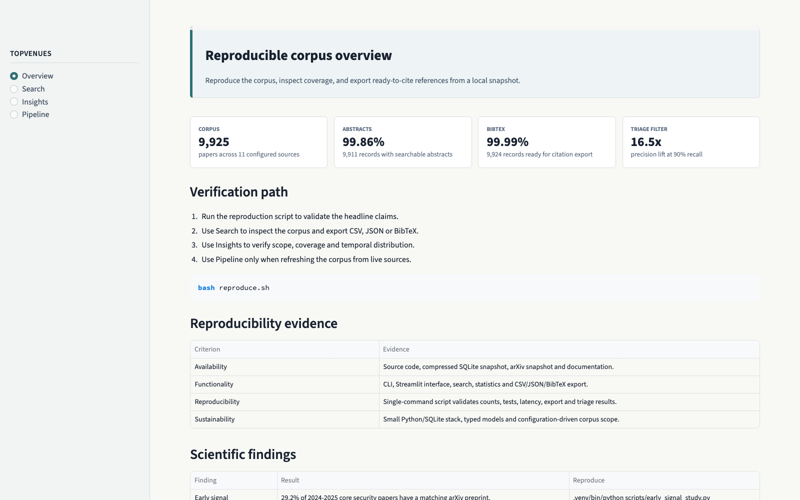

# TopVenues

**A reproducible bibliographic explorer for configured security research sources.**

`TopVenues` builds a curated, searchable SQLite dataset for a declared
computer-security literature scope. It downloads
metadata from DBLP, enriches every paper with abstracts pulled from open APIs
and publisher websites, and exposes a fast full-text search interface for
researchers, students and reviewers preparing literature reviews.

The current local dataset snapshot covers **9,925 papers** across **11 venues**,
with **9,911 abstracts** and **9,924 BibTeX records**.

---

## Indexed venues

| Venue                                                | Type       |
| ---------------------------------------------------- | ---------- |
| ACM CCS — Conference on Computer & Comm. Security    | Conference |
| IEEE S&P — Symposium on Security and Privacy         | Conference |
| USENIX Security                                      | Conference |
| NDSS — Network and Distributed System Security       | Conference |
| ACM ASIA CCS                                         | Conference |
| IEEE EURO S&P                                        | Conference |
| ACM SACMAT                                           | Conference |
| HotNets                                              | Workshop   |
| ACM Computing Surveys                                | Journal    |
| IEEE Communications Surveys & Tutorials              | Journal    |
| Foundations and Trends in Privacy and Security       | Journal    |

The set is configurable in `config.yaml`. Adding a new venue requires only a
URL strategy and an event-name normalizer — see *Extending* below.

---

## Quick start

```bash
git clone https://github.com/sidneibarbieri/topVenues.git
cd topVenues
python -m venv .venv && source .venv/bin/activate
pip install -r requirements.txt
```

That's it — the repository ships with the full SQLite database as a
compressed snapshot (`data/dataset/papers.db.gz`, ~15 MB). On first launch
the application transparently materialises `data/dataset/papers.db` (~74 MB)
from that snapshot, so there is **no manual import step**: 9,925 papers,
9,911 abstracts and 9,924 BibTeX entries are available immediately.

The released corpus is pinned by the compressed SQLite snapshot. The
human-readable `data/dataset/master_dataset.csv` file is a derived export of the
same frozen database, while `reproduce.sh` and the paper claims read the SQLite
snapshot. A refreshed corpus should be published as a new snapshot with a new
checksum and updated reported counts, rather than silently changing the
submission denominator.

When a newer snapshot lands upstream and you want to refresh your local
copy explicitly:

```bash
python -m src.cli refresh-db
```

### Web interface (recommended)

If your shell prompt already ends in `topVenues`, do not run `cd topVenues`
again; start from the commands below.

```bash
streamlit run web/app.py
```

If the optional web dependencies are not installed yet, run:

```bash
pip install -r requirements-web.txt
```

Open <http://localhost:8501>. Main pages:



- **Overview** — headline claims, reproduction command, evidence
  table and scientific findings.
- **Search** — full-text filters on title, abstract, authors, topic; venue,
  year, paper class (SoK / Survey / Poster / Workshop / Short / Journal /
  Article), abstract-length and BibTeX filters; sortable, paginated table
  that shows an abstract preview and the `\cite{...}` command for each row.
  CSV / JSON / `.bib` export.
- **Insights** — distributions by venue, year, class; abstract and
  BibTeX coverage.
- **Pipeline** — run download / consolidate / extract / bibtex directly
  from the UI.

### Command line

```bash
python -m src.cli download         # fetch DBLP JSON for all venues and years
python -m src.cli consolidate      # merge into SQLite (idempotent)
python -m src.cli extract          # fetch missing abstracts (rate-limited)
python -m src.cli bibtex           # fetch BibTeX entries from DBLP
python -m src.cli run-all          # download + consolidate + extract + bibtex

python -m src.cli search --title "SOC" --author "Sekar" --abstract "LLM"
python -m src.cli search --tech "blockchain" --year 2024
python -m src.cli export --format bibtex --tech "intrusion detection" -o intrusion.bib
python -m src.cli stats
```

### BibTeX & LaTeX integration

Every paper carries the BibTeX entry that DBLP would serve via its API,
plus a derived `\cite{cite_key}` snippet. The web UI shows both inline;
the **Search** page exports a ready-to-use `.bib` for the current
result set. Drop it into your LaTeX project and `\cite{…}` away.

`topVenues` ships **three** strategies for populating the `bibtex`
column. Pick whichever fits your situation:

| Command | Source | Time | Output | When to use |
| ------- | ------ | ---- | ------ | ----------- |
| `bibtex-from-dump` | DBLP XML dump | ~10 min one-off | DBLP-canonical, with crossref-resolved `editor` / `booktitle` | **Recommended.** Single 1 GB download, then offline. |
| `bibtex-local` | Existing DB fields | seconds | Minimal but valid (no `volume`/`number`) | No internet, or DBLP throttling. |
| `bibtex` | DBLP per-record API | hours (rate-limited) | DBLP-canonical | Filling a handful of new papers. |

```bash
# One-off, gold-standard: ~10 min, 100% coverage
python -m src.cli bibtex-from-dump

# Instant offline fallback: zero network, ~95% completeness
python -m src.cli bibtex-local

# Trickle fill via API (use --concurrency 2 to stay under DBLP's rate limit)
python -m src.cli bibtex --concurrency 2
```

The DB column is set-once-keep: re-running any command never overwrites
existing entries unless you explicitly pass `--overwrite` (only
available on `bibtex-local`). Combining commands works as expected:
run `bibtex-local` for instant coverage, then run `bibtex-from-dump`
later to upgrade entries to DBLP-canonical when you have the bandwidth.

### Incremental updates

The pipeline is fully incremental. Re-running `download → consolidate` next
year (or after a venue posts new proceedings) only fetches what is missing and
preserves every existing abstract via SQL `COALESCE`. To pick up a new year,
just bump `year_start` in `config.yaml` or leave it on the default — it
auto-extends to the current calendar year.

---

## Architecture

```
src/
  models.py            Pydantic DTOs (Paper, Configuration, SearchFilters,
                       AbstractImportResult, PaperClass)
  config.py            YAML configuration loader
  collector.py         Orchestrator (download → consolidate → extract)
  downloader.py        Async DBLP JSON downloader with circuit breaker
  consolidator.py      Merges JSON files into deduplicated Paper objects
  database.py          SQLite layer — single source of truth
  abstract_fetcher.py  Parallel fallback: Semantic Scholar / OpenAlex / CrossRef
  bibtex_fetcher.py    Concurrent DBLP .bib fetcher with retry / backoff
  event_normalizer.py  Venue string → canonical name (Strategy pattern)
  venue_config.py      DBLP URL strategy registry
  circuit_breaker.py   Circuit breaker for unstable upstreams
  extractors/          Per-publisher HTML extractors (xidel-based)
  cache.py             Local abstract cache (SQLite)
  checkpoint.py        Long-run resumability
  cli.py               Click CLI

web/app.py             Streamlit interface
tests/                 pytest suite (250 tests)
scripts/
  api_blitz.py         Concurrent API back-fill for missing abstracts
  bibtex_blitz.py      Concurrent BibTeX back-fill from DBLP
  verify_extractors.py Live integration check for publisher extractors
```

### Design highlights

- **SQLite is the single source of truth.** CSV and Pickle outputs are
  derived exports; the database survives every step of the pipeline.
- **Idempotent upsert.** Re-running `consolidate` 100× converges to the same
  state as running it once: existing abstracts are never overwritten.
- **Two-track abstract fetching.** Open APIs (Semantic Scholar, OpenAlex,
  CrossRef) are fired *in parallel* with `asyncio.as_completed` — first
  successful response wins. Publisher sites (ACM, IEEE, USENIX, NDSS) run
  *sequentially* with throttling because they sit behind Cloudflare.
- **Strategy / Registry patterns** for both venue URL generation and event
  name normalisation. Adding a new venue is purely additive.
- **Circuit breaker** wraps the DBLP downloader so a transient upstream
  outage stops cascading failures.
- **NDSS author-leak cleaner.** A comma-aware iterative matcher strips the
  `Name (Affiliation), Name (Affiliation), …` block that NDSS pages render
  before the abstract body — without ever truncating legitimate
  parentheticals like `Industrial Control Systems (ICS), …`.

---

## Configuration

`config.yaml` (defaults are sensible — edit only as needed):

```yaml
year_start: 2019                       # auto-extends to current year
events: [ccs, asiaccs, uss, ndss, sp,
         eurosp, hotnets, sacmat,
         acm_csur, ieee_comst, fnt_privsec]
batch_size: 10
acm_wait_min: 60.0                     # throttle window for publisher scrapers
acm_wait_max: 300.0
cache_enabled: true
cache_ttl_hours: 168
```

---

## Extending

To add a new venue:

1. Add the short identifier to `Configuration.events` and `EventType` in
   `src/models.py`.
2. Register a `VenueURLStrategy` in `src/venue_config.py` (point it at the
   DBLP page for that venue).
3. Add a normalisation rule in `src/event_normalizer.py` mapping DBLP's venue
   string to the canonical display name.
4. (Optional) add a publisher-specific extractor under `src/extractors/` if
   the open APIs don't cover that venue's papers reliably.

No code outside those four touch-points needs to change.

---

## Development

```bash
pip install -e ".[dev]"
pytest                         # 250 tests
ruff check src/ web/ tests/
```

---

## Paper and artifact preparation

Paper drafts are kept out of the public artifact under `papers/` (a local,
untracked directory) so that the released code and corpus stay independent of
any specific manuscript or venue. Artifact-evaluation notes are in
`ARTIFACT_README.md`, `REVIEWER_GUIDE.md`, and `PROJECT_STRUCTURE.md`.
Literature-review support and reference material live under `literature/`.

---

## Data sources

- [DBLP](https://dblp.org) — paper metadata
- [Semantic Scholar](https://www.semanticscholar.org/product/api) — abstracts
- [OpenAlex](https://openalex.org) — abstracts (inverted index)
- [CrossRef](https://www.crossref.org) — abstracts (JATS XML)
- Publisher sites (ACM Digital Library, IEEE Xplore, USENIX, NDSS) — abstracts

All retrieval is read-only and respects published API rate limits.

---

## Citation

If `TopVenues` helps your research, please cite it:

```bibtex
@software{barbieri_topvenues,
  author = {Barbieri, Sidnei and Ferraz, Agney Lopes Roth and Pereira Junior, Lourenco Alves},
  title  = {TopVenues: a bibliographic explorer for top-tier security venues},
  year   = {2026},
  url    = {https://github.com/sidneibarbieri/topVenues}
}
```

---

## Authors

**Sidnei Barbieri**, **Agney Lopes Roth Ferraz**, and
**Lourenco Alves Pereira Junior**.

Built to support systematic literature reviews and threat-landscape mapping
across the top-tier security research venues.

---

## License

MIT — see [LICENSE](LICENSE).
