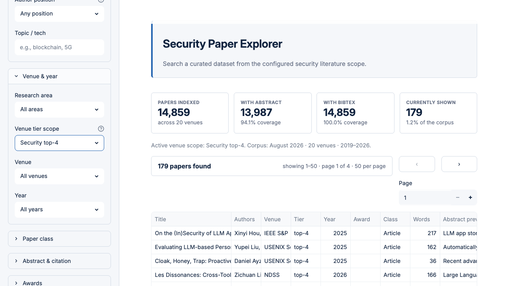
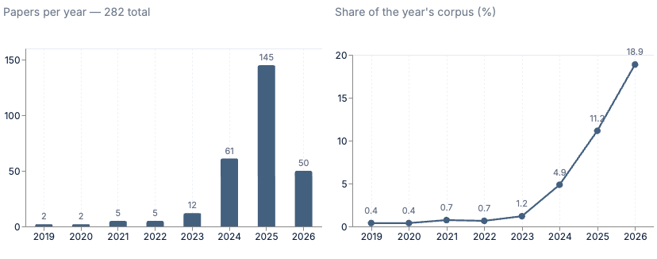
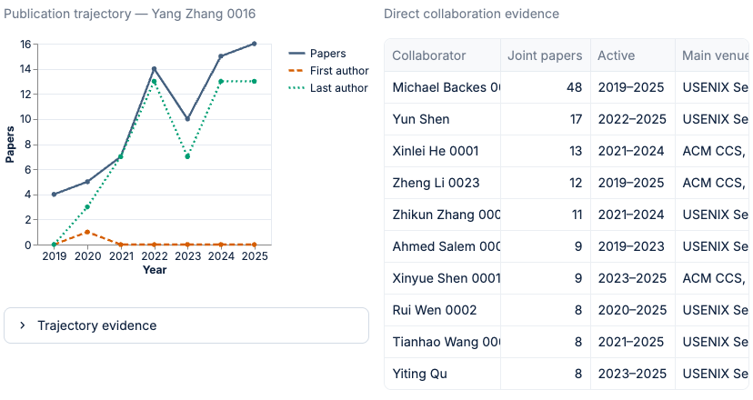
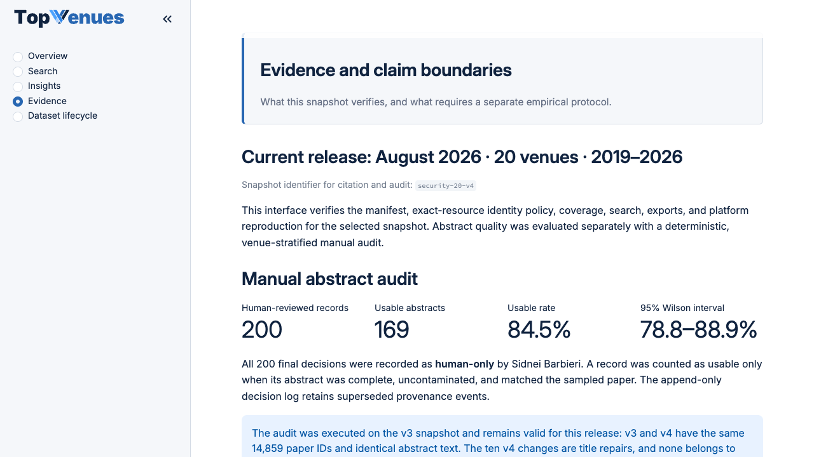
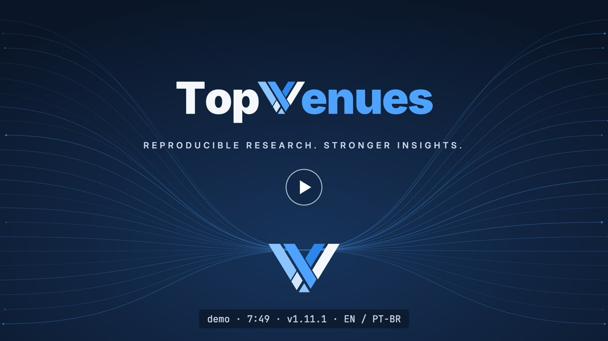

<p align="center">
  <a href="https://sidneibarbieri.github.io/topVenues/">
    <picture>
      <source media="(prefers-color-scheme: dark)" srcset="docs/brand/topvenues-wordmark-reversed.svg">
      
    </picture>
  </a>
</p>

<p align="center">
  <strong>Every literature review has a denominator.</strong><br>
  TopVenues makes it declared, frozen and executable: a versioned corpus of
  cybersecurity venues that you can search, analyse, cite, and reproduce with
  one command.
</p>

<p align="center">
  <a href="https://github.com/sidneibarbieri/topVenues/actions/workflows/tests.yml"></a>
  <a href="https://github.com/sidneibarbieri/topVenues/releases/latest"></a>
  <a href="https://huggingface.co/datasets/sidneibarbieri/topvenues"></a>
  
  <a href="LICENSE"></a>
</p>

<p align="center">
  <a href="https://sidneibarbieri.github.io/topVenues/">Project page</a> ·
  <a href="https://huggingface.co/datasets/sidneibarbieri/topvenues">Dataset</a> ·
  <a href="docs/PAPERS.md">Published papers</a> ·
  <a href="README.pt-BR.md">Português</a>
</p>

---

## Start here

| I want to… | Do this |
| --- | --- |
| Use TopVenues today | [Quick start](#quick-start), profile `security-20-v4` |
| Get only the data | `load_dataset("sidneibarbieri/topvenues")` from [Hugging Face](https://huggingface.co/datasets/sidneibarbieri/topvenues) |
| Reproduce the SBSeg 2026 main-track paper | `git checkout sbseg2026-camera-ready && bash reproduce.sh` ([details](docs/PAPERS.md#paper-a--main-track-sbseg-2026)) |
| Reproduce the SBSeg 2026 tools-track paper | `bash reproduce.sh --profile security-20` ([details](docs/PAPERS.md#paper-b--tools-track-sbseg-2026)) |
| Work with Claude, Codex or ChatGPT | [With AI assistants](#with-ai-assistants) |
| Cite TopVenues | [Citation](#citation) |

## Quick start

### Linux and macOS

Requires Python 3.11–3.14, Git, and Bash.

```bash
git clone --depth 1 --branch v1.11.1 https://github.com/sidneibarbieri/topVenues.git
cd topVenues
bash reproduce.sh --profile security-20-v4
```

The command installs the CLI and web dependencies, verifies the snapshot
manifest, materializes a disposable SQLite database, runs the regression suite,
starts and health-checks the web interface, exercises search, and writes a
BibTeX sample. It needs no API key, institutional access, publisher credential,
or GPU. Once dependencies are installed, validation is offline.

### Native Windows

Requires Python 3.11–3.14 with the Python Launcher (`py`), Git, and PowerShell.
Use the native PowerShell workflow rather than editing the Unix script or mixing
Git Bash and PowerShell environments:

```powershell
git clone --depth 1 --branch v1.11.1 https://github.com/sidneibarbieri/topVenues.git
cd topVenues
powershell -ExecutionPolicy Bypass -File .\reproduce.ps1 -Profile security-20-v4
```

The script creates `.venv` and installs the hash-locked cross-platform
`requirements-frozen.txt` itself. If a prior attempt created `.venv` with Python
3.10 or older, remove only that directory before rerunning:
`Remove-Item -Recurse -Force .venv`.

Do not start a second reproduction while one is running. The verification
script refreshes a disposable local SQLite copy; materialization is serialized,
and a locked database produces an actionable wait-and-retry error.

### Open the interface

```bash
source .venv/bin/activate
python -m streamlit run web/app.py
```

On Windows PowerShell, activate with `.\.venv\Scripts\Activate.ps1` before
running the same command. The interface opens at `http://localhost:8501`.

## The current release

| Property | Value |
| --- | --- |
| Tool release | `v1.11.1` |
| Profile | `security-20-v4` |
| Snapshot source release | `v1.2.1` |
| Scope | 20 declared security and security-relevant venues |
| Declared window | 2019–2026 |
| Records | 14,859 corpus records |
| Abstract-enriched records | 13,987 (94.1%) |
| BibTeX entries | 14,859 |
| Snapshot SHA-256 | `bcb762c1c9b1f8ce6f075a8c1a23d68310caec853b0cc8ce3f42931e43c370c5` |

The profile enforces the declared 2019–2026 window, inherits exact-resource
deduplication, and repairs ten titles truncated at inline DBLP markup. Four
same-metadata pairs remain separate because their publisher resources remain
distinct; metadata similarity alone is not identity evidence. The versioned
decision records are in `data/adjudication/`. Records without abstracts remain
available for metadata and citation workflows; abstract-dependent retrieval must
treat them as missing data, not negative evidence. The declared scope,
per-venue coverage, identity policy, and exact snapshot identity are in
`profiles/security-20-v4/config.yaml` and
`data/profiles/security-20-v4/manifest.json`.

## What you can do

<table>
  <tr>
    <td width="50%"></td>
    <td width="50%"></td>
  </tr>
  <tr>
    <td><b>Ranked search.</b> BM25 over titles and abstracts, with an explicit Security top-4 scope: ACM CCS, IEEE S&amp;P, USENIX Security and NDSS.</td>
    <td><b>Topic trends.</b> How often a topic appears per year, in absolute counts and as a share of that year's corpus.</td>
  </tr>
  <tr>
    <td></td>
    <td></td>
  </tr>
  <tr>
    <td><b>Researcher Radar.</b> Exact-identity trajectories and direct coauthorship. Corpus observations, not measures of quality or impact.</td>
    <td><b>Evidence.</b> What the snapshot verifies, and what needs a separate protocol, such as the 200-record manual abstract audit.</td>
  </tr>
</table>

Every aggregate is traceable to the records behind it. Search and author
analytics offer an explicit Security top-4 scope; Researcher Radar adds recent
publication-rate change, portable watchlists, and an explicitly unverified arXiv
name-search handoff. See [docs/RESEARCH_WORKFLOWS.md](docs/RESEARCH_WORKFLOWS.md)
before using a tier restriction or a monitoring signal.

### Command-line workflows

```bash
# Inspect corpus state and coverage
python -m src.cli --profile security-20-v4 stats

# Search records that mention a term
python -m src.cli --profile security-20-v4 search --abstract "intrusion detection"

# Restrict a review query to the Security top-4
python -m src.cli --profile security-20-v4 search --rank "LLM security" \
  --tier-scope "Security top-4" --limit 20

# Build a topic-specific author shortlist from Tier 1 evidence
python -m src.cli --profile security-20-v4 authors --topic "fuzzing" \
  --tier-scope "Security top-4"

# Rank records by multi-token FTS5/BM25 relevance
python -m src.cli --profile security-20-v4 search --rank "memory corruption mitigations" --limit 20

# Export a review-ready subset
python -m src.cli --profile security-20-v4 export --format bibtex --tech "fuzzing" \
  --tier-scope "Security top-4" -o fuzzing-tier1.bib

# Build the Hugging Face Parquet export from the immutable profile
python -m src.cli --profile security-20-v4 export-hf --release-tag v1.11.1

# Create and later evaluate a portable research watch
python scripts/evaluate_watchlist.py topvenues-watchlist.json --profile security-20-v4

# Repeat or extend the deterministic manual-audit protocol
python scripts/manual_abstract_audit.py --profile security-20-v4 --sample-size 200
```

Substring and ranked search answer different questions: substring search finds
records that mention text, whereas ranked search orders title, abstract, and
author matches by BM25. Multi-word ranked queries use token semantics.

### With AI assistants

A terminal agent such as Claude Code or Codex CLI can drive the CLI above.
[`AGENTS.md`](AGENTS.md) tells it to answer from the snapshot, cite with the
exported BibTeX, and state the denominator with every number. The assistant does
the reading and writing; TopVenues guarantees that every paper exists and that
every count can be checked. [docs/AI_ASSISTANTS.md](docs/AI_ASSISTANTS.md)
covers desktop and chat-only assistants and gives prompts that work.

## Published papers, frozen evidence

The software evolves; published evidence does not. Each SBSeg 2026 paper is
bound to one release, one snapshot, one SHA-256, and one command, and its numbers
are reproduced from that snapshot, never from whatever the current release
ships. [docs/PAPERS.md](docs/PAPERS.md) is the registry.

| Paper | Snapshot | Reproduce |
| --- | --- | --- |
| Main track: *A Reproducible Corpus and Tooling Substrate for Cybersecurity Literature Reviews* | 9,925 records, 11 venues (`sbseg2026-camera-ready`) | `git checkout sbseg2026-camera-ready && bash reproduce.sh` |
| Tools track: *An Executable Corpus and Research Tool for Cybersecurity Literature Reviews* | 20,305 records, 20 venues (`security-20`) | `bash reproduce.sh --profile security-20` |

Continuous integration re-runs both on every change: the tools-track profile on
Ubuntu and Windows with Python 3.11–3.14, and the main-track release on Ubuntu.
A change that breaks a published result cannot pass.

## One repository

Until v1.10.0, TopVenues was developed in
[`sidneibarbieri/topvenues-tool`](https://github.com/sidneibarbieri/topvenues-tool).
From v1.11.0 on, everything lives here. That repository is archived read-only:
its history and release tags remain available, and the command printed in the
tools-track paper still runs against it unchanged.

## Demonstration

[](https://huggingface.co/datasets/sidneibarbieri/topvenues/resolve/main/assets/demo/topvenues-demo-v1.11.1.mp4)

Seven minutes and forty-nine seconds in 1920x1080, streamed from Hugging Face.
It follows one path end to end: the problem a fixed denominator solves,
installation and offline verification, an ordinary search with its exports,
the four passes of the Insights page, the audit evidence, and the immutability
boundary. It was recorded with v1.11.1, in the current visual identity.
Narration is US English; captions ship in Brazilian Portuguese and English.
Sidecar SRT files, the timed narration source, and the shot plan are in
[docs/demo/](docs/demo/README.md).

## Scope and extension

Venue names and policies are explicit because they define the scientific
denominator. Adding a venue requires a deliberate configuration change, a
normalization mapping, a coverage check, a new immutable profile snapshot, and a
new release tag. It is not a routine refresh of this object.

Live `download`, `consolidate`, `extract`, and `bibtex` commands are maintenance
operations. They may use changing external services; they do not alter the
committed release snapshot. Unexpected collection errors surface to the caller
rather than being silently converted into successful enrichment.

The released profile disables live refresh controls in the web interface. The
**Dataset lifecycle** page describes the boundary; the controlled
successor-profile procedure is in [docs/PROFILE_REFRESH.md](docs/PROFILE_REFRESH.md).

The main-track paper's 200-record audit and live baseline comparison are
documented in [docs/COMPANION_FULL_PAPER_EVALUATION.md](docs/COMPANION_FULL_PAPER_EVALUATION.md)
and remain bound to that paper's snapshot. The current corpus has a separate
completed 200-record human audit: 169 records satisfied all three criteria
(84.5%; 95% Wilson interval 78.8%–88.9%). The v3 labels transfer to v4 because
every paper ID and abstract byte is unchanged; the machine-readable transfer
check is in `evaluation/security-20-v4/audit_transfer.json`. See
[docs/MANUAL_ABSTRACT_AUDIT.md](docs/MANUAL_ABSTRACT_AUDIT.md).

## Distribution boundary

The package bundles the snapshots for `security-20`, `security-20-v3` and
`security-20-v4`. `security-20` is among them because the published
tools-track paper prints `bash reproduce.sh --profile security-20` as its
reviewer's command, and that command runs against a clone with no fetch step.

`security-20-v2` keeps its manifest visible while its unchanged binary stays in
the release tag where it was published. Fetch it explicitly with
`python scripts/fetch_archived_profile.py --profile security-20-v2`, so a
reviewer downloads a superseded corpus only when they actually want to compare
against it.

## Hugging Face

The public dataset is
[sidneibarbieri/topvenues](https://huggingface.co/datasets/sidneibarbieri/topvenues):
a Parquet export of `security-20-v4` whose card records the profile, the source
tag, and the snapshot SHA-256.

```python
from datasets import load_dataset

corpus = load_dataset("sidneibarbieri/topvenues", split="train")
security = corpus.filter(lambda paper: paper["area"] == "security")
```

## Citation

If TopVenues supports your research, cite the paper whose numbers you use, and
star this repository so that other researchers can find it. The tools-track paper
describes the tool and `security-20`; the main-track paper describes the corpus
method and its measurements. GitHub's "Cite this repository" reads
[CITATION.cff](CITATION.cff). When you use the current release, also name the
profile and its SHA-256.

```bibtex
@inproceedings{barbieri2026topvenues,
  author    = {Sidnei Barbieri and {\'A}gney Lopes Roth Ferraz and Louren{\c{c}}o Alves {Pereira J{\'u}nior}},
  title     = {{TopVenues}: A Reproducible Corpus and Tooling Substrate for Cybersecurity Literature Reviews},
  booktitle = {Anais do XXVI Simp{\'o}sio Brasileiro de Ciberseguran{\c{c}}a (SBSeg 2026)},
  pages     = {1150--1165},
  year      = {2026},
  publisher = {Sociedade Brasileira de Computa{\c{c}}{\~a}o},
  doi       = {10.5753/sbseg.2026.29056},
  url       = {https://sol.sbc.org.br/index.php/sbseg/article/view/44350}
}

@inproceedings{barbieri2026topvenuestool,
  author    = {Sidnei Barbieri and {\'A}gney Lopes Roth Ferraz and Louren{\c{c}}o Alves {Pereira J{\'u}nior}},
  title     = {{TopVenues}: An Executable Corpus and Research Tool for Cybersecurity Literature Reviews},
  booktitle = {Anais Estendidos do XXVI Simp{\'o}sio Brasileiro de Ciberseguran{\c{c}}a (SBSeg 2026)},
  pages     = {234--241},
  year      = {2026},
  publisher = {Sociedade Brasileira de Computa{\c{c}}{\~a}o},
  doi       = {10.5753/sbseg_estendido.2026.33733},
  url       = {https://sol.sbc.org.br/index.php/sbseg_estendido/article/view/44470}
}
```

Both DOIs are assigned but not yet registered with Crossref; the SOL links
resolve today.

## Authors

- Sidnei Barbieri — `sidneibarbieri@gmail.com`
- Ágney Lopes Roth Ferraz — `agneyroth@gmail.com`
- Lourenço Alves Pereira Júnior — `lourenco.junior@gp.ita.br`

Instituto Tecnológico de Aeronáutica (ITA), São José dos Campos, Brazil.

For a concise evidence map, read [REVIEWER_GUIDE.md](REVIEWER_GUIDE.md). For the
full artifact boundary, read [ARTIFACT_README.md](ARTIFACT_README.md).

## License and provenance

TopVenues code is released under the MIT license. DBLP bibliographic metadata
and BibTeX follow DBLP's CC0 terms. Original abstract text remains subject to its
source terms; the tool records provenance and does not claim ownership of
third-party abstracts. The TopVenues name and mark are described in
[docs/brand/BRAND.md](docs/brand/BRAND.md).
