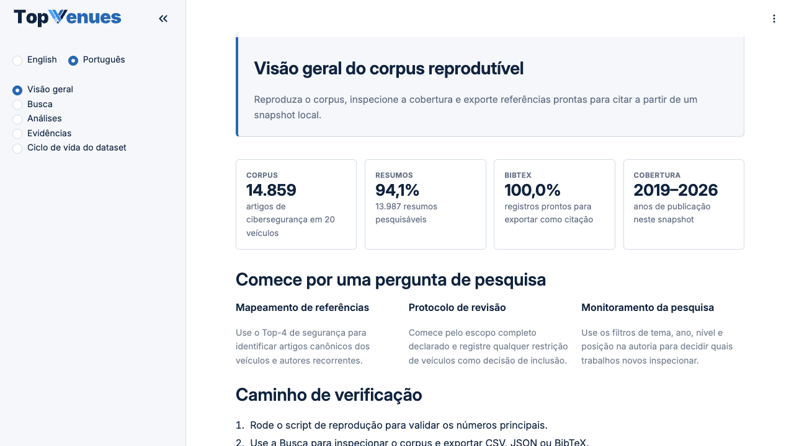
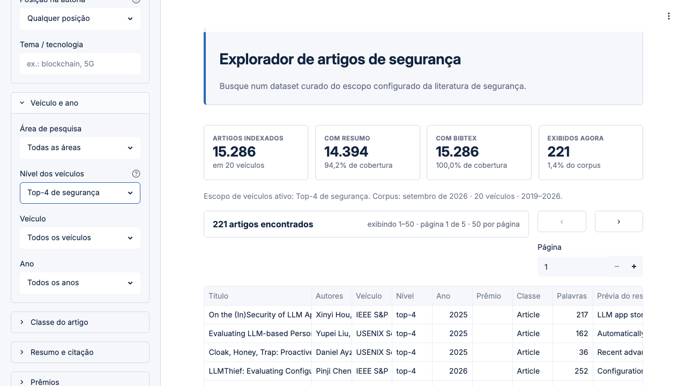
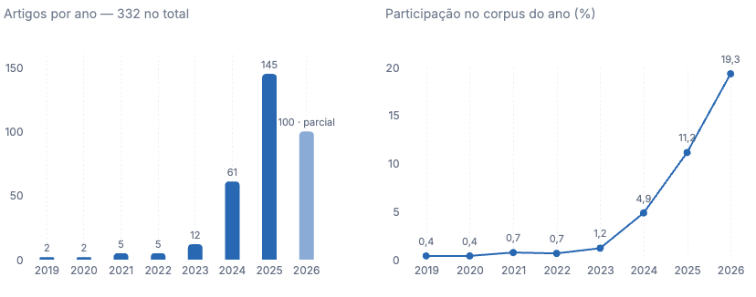
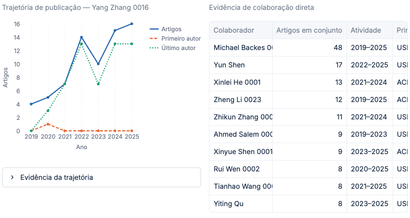
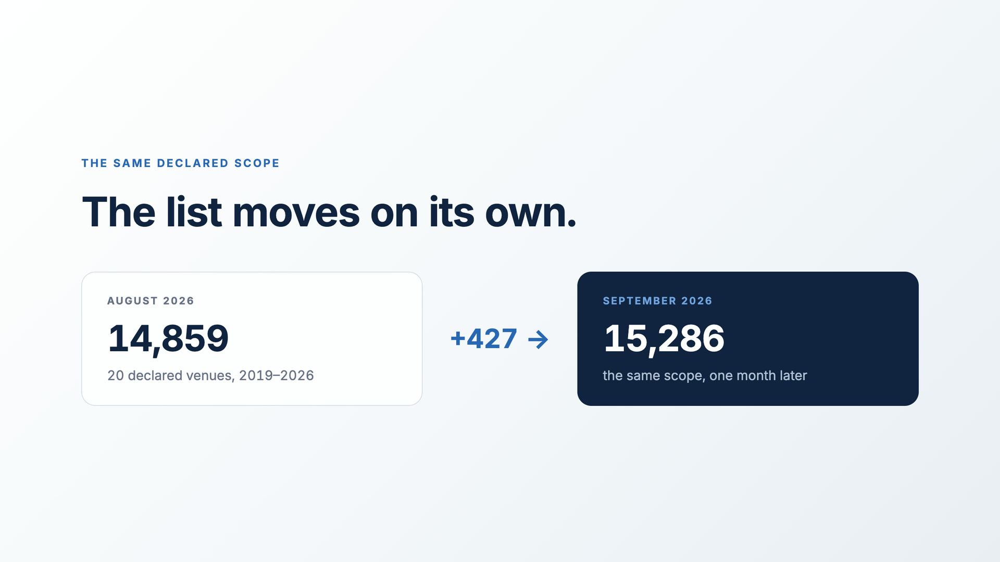

# TopVenues

<p align="center">
  <picture>
    <source media="(prefers-color-scheme: dark)" srcset="docs/brand/topvenues-wordmark-reversed.svg">
    
  </picture>
</p>

[](https://github.com/sidneibarbieri/topVenues/actions/workflows/tests.yml)
[](LICENSE)
[](#dependências)

**Documentação em português, no modelo mínimo do CTA do SBSeg.** Ela reproduz as
reivindicações do artigo #189 do Salão de Ferramentas, SBSeg 2026:
*TopVenues: An Executable Corpus and Research Tool for Cybersecurity Literature Reviews*
Sidnei Barbieri, Ágney Roth Ferraz, Lourenço Alves Pereira Júnior (ITA)

Revisões de literatura em segurança dependem de um denominador estável: o
conjunto de artigos elegíveis antes de a triagem começar. Na prática, esse
denominador é remontado a partir de portais, APIs e exportações que mudam ao
longo do tempo, o que torna o corpus resultante difícil de auditar ou reutilizar.

O TopVenues transforma a construção do corpus em um artefato de pesquisa
executável. Dado um escopo declarado de veículos e anos, ele normaliza metadados
do DBLP, enriquece registros com resumos e entradas BibTeX, e materializa um
snapshot SQLite monotônico exposto por uma interface de linha de comando, uma
aplicação web, busca ranqueada e exportações orientadas a revisão. O release
declara sua política de veículos, distingue registros bibliográficos de registros
enriquecidos com resumo, e registra proveniência em nível de campo. Um revisor
consegue verificar um snapshot fixado offline, exercitar busca ranqueada e
exportações, e reproduzir os fluxos vinculados ao snapshot que acompanham o
release.

> **Documentação em inglês:** [README.md](README.md) descreve a mesma
> ferramenta para leitores internacionais. Este arquivo segue o modelo exigido
> pelo CTA. A [página do projeto](https://sidneibarbieri.github.io/topVenues/)
> reúne os dois artigos, os dados e a demonstração.

---

## Reprodução em um comando

Copie e execute. Nada mais é necessário: sem contas, sem chaves, sem
configuração, sem privilégios de administrador.

```bash
git clone https://github.com/sidneibarbieri/topVenues
cd topVenues
bash reproduce.sh --profile security-20
```

No Windows, a última linha é:

```powershell
powershell -ExecutionPolicy Bypass -File .\reproduce.ps1 -Profile security-20
```

Em cerca de quatro minutos o script instala as dependências fixadas, verifica o
SHA-256 do corpus, executa a suíte de testes, renderiza a interface, confere as
oito reivindicações do artigo, reproduz a Tabela 2, compara a busca ranqueada com
a linha de base, exporta uma amostra BibTeX e grava um registro da execução.
Termina em `Profile security-20 reproduced successfully`.

Depois disso, o [Teste mínimo](#teste-mínimo) mostra a ferramenta em uso e os
[Experimentos](#experimentos) detalham cada reivindicação isoladamente.

---

## Qual artefato usar

O TopVenues tem dois artigos publicados no SBSeg 2026. Cada um fica preso à
sua versão e ao seu snapshot, e é reproduzido a partir deles, nunca da versão
corrente. O [registro dos artigos](docs/PAPERS.md) traz o SHA-256 e o comando de
cada um.

| Quero… | Onde |
| --- | --- |
| Reproduzir o artigo do Salão de Ferramentas | `bash reproduce.sh --profile security-20` |
| Reproduzir o artigo da trilha principal | `git checkout sbseg2026-camera-ready && bash reproduce.sh` |
| Usar o corpus atual | perfil `security-20-v5` ([README.md](README.md)) |
| Baixar os dados | [Hugging Face `sidneibarbieri/topvenues`](https://huggingface.co/datasets/sidneibarbieri/topvenues) |

Até a v1.10.0 o TopVenues foi desenvolvido em
[`sidneibarbieri/topvenues-tool`](https://github.com/sidneibarbieri/topvenues-tool),
o endereço impresso no artigo do Salão de Ferramentas. Desde a v1.11.0 tudo fica
aqui. Aquele repositório está arquivado, somente leitura, e o comando impresso
no artigo continua funcionando nele sem alteração.

---

## A ferramenta em uso

| | |
| --- | --- |
|  |  |
| **Visão geral** — identidade do corpus, cobertura e caminho de verificação. | **Busca** — consulta ranqueada restrita ao top-4 de segurança, com o registro por trás de cada linha. |
|  |  |
| **Análises** — distribuição por veículo, ano e classe; volume de um tópico e sua participação normalizada. | **Autores** — recorrência por volume, peso por nível ou concentração no top-4, com trajetória e coautoria. |

[](https://huggingface.co/datasets/sidneibarbieri/topvenues/resolve/main/assets/demo/topvenues-demo-v1.14.0.pt-BR.mp4)

**Demonstração em vídeo** (2min32s, 1920x1080, narração em inglês): a lista que
muda sozinha, a ideia, um comando num clone novo, a busca com as exportações,
onde o corpus se cala, e o que uma lista fixa torna mensurável. Mostra a
v1.14.0 sobre o perfil `security-20-v5`, então as contagens que aparecem são as
da versão atual.

As legendas vêm queimadas em dois arquivos, um
[em português](https://huggingface.co/datasets/sidneibarbieri/topvenues/resolve/main/assets/demo/topvenues-demo-v1.14.0.pt-BR.mp4) e outro
[em inglês](https://huggingface.co/datasets/sidneibarbieri/topvenues/resolve/main/assets/demo/topvenues-demo-v1.14.0.en.mp4). O
[master sem legenda](https://huggingface.co/datasets/sidneibarbieri/topvenues/resolve/main/assets/demo/topvenues-demo-v1.14.0.mp4), com as faixas WebVTT,
está em [docs/demo/](docs/demo/README.md).

**Com assistentes de IA** (Claude, Codex, ChatGPT): um agente de terminal usa a
linha de comando e segue o [`AGENTS.md`](AGENTS.md). Ele responde a partir do
snapshot, cita com o BibTeX exportado e declara o denominador de cada número. O
[guia](docs/AI_ASSISTANTS.md) cobre também assistentes de desktop e de chat, com
prompts prontos.

---

# Estrutura do readme.md

Este README segue o modelo mínimo exigido pelo CTA do SBSeg 2026.

| Seção | Conteúdo |
| --- | --- |
| [Selos Considerados](#selos-considerados) | Quais selos são pleiteados |
| [Informações básicas](#informações-básicas) | Ambiente de execução, hardware e software |
| [Dependências](#dependências) | Versões, fixação por hash e recursos de terceiros |
| [Preocupações com segurança](#preocupações-com-segurança) | Riscos para quem executa (nenhum) |
| [Instalação](#instalação) | Clone e um único comando |
| [Teste mínimo](#teste-mínimo) | Verificação rápida de que a ferramenta funciona |
| [Experimentos](#experimentos) | Uma subseção por reivindicação do artigo |
| [Verificação contínua](#verificação-contínua) | Reprodução automática em 8 ambientes |
| [Histórico de versões](#histórico-de-versões) | O que mudou em cada versão |
| [LICENSE](#license) | Licença do código e dos dados |

O apêndice do artefato exigido pelo CTA, com os mesmos dados em formato PDF, está
em [`docs/artifact-appendix/`](docs/artifact-appendix/TopVenues-189-Apendice.pdf).

Organização do repositório:

```
topVenues/
├── README.md                  documentação em inglês
├── README.pt-BR.md            este arquivo (modelo do CTA)
├── AGENTS.md                  instruções para agentes de IA (Claude Code, Codex)
├── reproduce.sh               reprodução em uma linha (macOS e Linux)
├── reproduce.ps1              reprodução em uma linha (Windows / PowerShell)
├── Dockerfile                 imagem alternativa, mesmas dependências fixadas
├── docker-compose.yml         atalho de uma linha para a imagem
├── requirements-frozen.txt    dependências fixadas e verificadas por hash
├── uv.lock                    lockfile equivalente para o gerenciador uv
├── config.yaml                escopo declarado de veículos e anos
├── profiles/                  configuração de cada perfil imutável
├── data/profiles/             snapshots comprimidos e seus manifestos
├── src/                       biblioteca e interface de linha de comando
├── web/                       aplicação Streamlit
├── scripts/                   automação de verificação e de experimentos
├── tests/                     407 testes automatizados
└── docs/                      guia do revisor, protocolo de auditoria, demonstração
```

---

# Selos Considerados

Os selos considerados são: **Disponíveis (SeloD)**, **Funcionais (SeloF)**,
**Sustentáveis (SeloS)** e **Experimentos Reprodutíveis (SeloR)**.

| Selo | Onde é atendido |
| --- | --- |
| **SeloD** | Repositório público e estável no GitHub, com este README no modelo do CTA e release marcado por tag. |
| **SeloF** | [Dependências](#dependências) com versões fixadas, [Informações básicas](#informações-básicas) com o ambiente, [Instalação](#instalação) e [Teste mínimo](#teste-mínimo). |
| **SeloS** | Código modularizado com documentação por módulo e função, parametrização fora do código (`config.yaml`, `profiles/`), e as reivindicações do artigo identificadas no artefato por `scripts/verify_paper_claims.py`. |
| **SeloR** | [Experimentos](#experimentos), uma subseção por reivindicação, com comando, tempo, recursos, resultado esperado e linha de base para comparação. |

---

# Informações básicas

## Ambiente utilizado nos experimentos

Os resultados relatados no artigo e nesta documentação foram obtidos no
seguinte ambiente:

| Item | Valor |
| --- | --- |
| Sistema operacional | macOS 26.5.2 (build 25F84) |
| Kernel | Darwin 25.5.0 |
| Arquitetura | arm64 (Apple Silicon) |
| Processador | Apple M4 Max, 16 núcleos |
| Memória RAM | 64 GB |
| Armazenamento livre | 53 GB |
| Python | 3.14.7 |

## Requisitos mínimos para reprodução

O artefato não exige o hardware acima. Os requisitos mínimos verificados são:

| Recurso | Mínimo | Observação |
| --- | --- | --- |
| Sistema operacional | Linux, macOS ou Windows 10+ | `reproduce.sh` em Linux/macOS; `reproduce.ps1` em Windows |
| Python | 3.11 ou superior | Testado em 3.11, 3.12, 3.13 e 3.14 |
| Memória RAM | 4 GB | Pico medido durante a reprodução completa: 943 MB |
| Espaço em disco | 2,5 GB | Medido: 452 MB de clone raso, 435 MB de ambiente virtual, 413 MB de banco materializado; um clone completo ocupa 1,9 GB por causa do histórico |
| Rede | Apenas na instalação | Necessária para baixar as dependências. A verificação, a busca e as exportações são offline. |
| Navegador | Qualquer navegador atual | Somente para a interface web; a linha de comando não precisa dele. |
| Privilégios | Usuário comum | Não requer administrador nem `sudo`. |

## Tempo total esperado

| Etapa | Tempo no ambiente acima | Tempo estimado em máquina modesta |
| --- | --- | --- |
| Instalação das dependências | 60–120 s | até 5 min |
| Reprodução completa (`reproduce.sh`) | ~4 min | até 12 min |
| Teste mínimo | ~90 s | até 4 min |

---

# Dependências

## Fixação de versões

Todas as dependências de execução são instaladas a partir de
**`requirements-frozen.txt`**, que fixa 71 pacotes por versão exata e contém
1.161 hashes SHA-256. A instalação usa `pip install --require-hashes`, portanto
qualquer divergência de bytes interrompe a instalação em vez de produzir um
ambiente diferente do relatado. O mesmo conjunto está disponível como
**`uv.lock`** para quem usa o gerenciador `uv`, que o `reproduce.sh` prefere
quando encontra.

**As dependências da interface web estão incluídas nesse mesmo arquivo.** Não há
passo adicional: `streamlit`, `altair` e `watchdog` são instalados junto com o
restante, e o `reproduce.sh` exibe isso explicitamente na primeira etapa. O
arquivo `requirements-web.txt` existe apenas como declaração legível do
subconjunto web e **não** é usado por nenhum caminho de instalação.

## Dependências principais

<!-- dependency-table:start -->

| Pacote | Versão fixada | Função |
| --- | --- | --- |
| `pandas` | 3.0.3 | Manipulação tabular e exportações |
| `pyarrow` | 24.0.0 | Escrita de Parquet |
| `pydantic` | 2.13.4 | Modelos de dados validados |
| `httpx` | 0.28.1 | Cliente HTTP dos coletores |
| `beautifulsoup4` | 4.15.0 | Extração de resumos em HTML |
| `click` | 8.4.2 | Interface de linha de comando |
| `rich` | 15.0.0 | Saída formatada no terminal |
| `pyyaml` | 6.0.3 | Leitura da configuração declarada |
| `streamlit` | 1.58.0 | Interface web |
| `altair` | 6.2.2 | Gráficos da interface web |
| `pytest` | 9.1.1 | Suíte de testes automatizados |
| `ruff` | 0.15.20 | Verificação de estilo e lint |

<!-- dependency-table:end -->

A lista completa, com hashes, está em `requirements-frozen.txt`.

## Recursos de terceiros

**Nenhuma chave de API, credencial ou conta é necessária para reproduzir o
artefato.** O snapshot já acompanha o repositório.

Serviços externos são usados apenas pelos comandos opcionais de coleta
(`download`, `consolidate`, `extract`), que **não** fazem parte da reprodução e
**não** alteram o snapshot publicado: DBLP, Semantic Scholar, OpenAlex, CrossRef,
ACM Digital Library, IEEE Xplore, USENIX e NDSS. Todos são consultados por
endpoints públicos e sem autenticação.

---

# Preocupações com segurança

**A execução deste artefato não oferece risco a quem o executa.**

- Não requer privilégios de administrador nem `sudo`.
- Não instala serviços, não altera configurações do sistema e não abre portas
  para fora da máquina. A interface web escuta apenas em `localhost`.
- Não executa código de terceiros baixado em tempo de execução: as dependências
  são fixadas por hash na instalação.
- Não coleta, transmite nem armazena dados pessoais de quem o executa.
- A reprodução é **offline** após a instalação das dependências. Os comandos que
  acessam a rede são opcionais, estão claramente identificados e não são
  exercitados por `reproduce.sh`.
- Todos os arquivos criados ficam dentro do diretório do repositório clonado.
  Remover o diretório desfaz completamente a instalação.
- O snapshot é aberto em modo somente leitura (`mode=ro&immutable=1`), de forma
  que a execução não pode corromper o corpus verificado.

---

# Instalação

## Linux e macOS

```bash
git clone https://github.com/sidneibarbieri/topVenues
cd topVenues
bash reproduce.sh --profile security-20
```

## Windows (PowerShell)

```powershell
git clone https://github.com/sidneibarbieri/topVenues
cd topVenues
powershell -ExecutionPolicy Bypass -File .\reproduce.ps1 -Profile security-20
```

## Docker (alternativa)

```bash
docker compose up          # interface web em http://localhost:8501
docker compose run --rm app python -m pytest -q
```

A imagem instala exatamente as mesmas dependências fixadas por hash do
`reproduce.sh`.

## Solução de problemas

**"Cannot refresh papers.db because it is open" / erro ao iniciar o banco.**
Ocorre quando a interface web (ou outro processo) está com o corpus aberto e o
script tenta materializá-lo de novo. No Windows o sistema operacional bloqueia o
arquivo de forma mais estrita que no Linux e no macOS, então esse caso aparece
primeiro ali. Feche a aba do Streamlit, encerre o processo `streamlit` e execute
o script novamente. A materialização é protegida por um lock atômico e
multiplataforma: duas execuções simultâneas se serializam em vez de corromper o
banco, e a segunda espera até 30 segundos antes de relatar `CorpusBusyError` com
a instrução acima.

**PowerShell recusa executar o script.** Use exatamente a forma documentada,
`powershell -ExecutionPolicy Bypass -File .\reproduce.ps1`, que não altera a
política do sistema — ela vale só para aquela invocação.

**`python` não encontrado no Windows.** O script tenta `py -3`, `python3` e
`python`, nessa ordem. Se nenhum existir, instale o Python 3.11+ pela
[python.org](https://www.python.org/downloads/) marcando *Add python.exe to PATH*.

**A execução deixou `data/papers.db` para trás.** É o banco materializado e
descartável; pode ser apagado a qualquer momento. O snapshot comprimido em
`data/profiles/` é a fonte de verdade e nunca é modificado.

O script cria um ambiente virtual isolado em `.venv/`, instala as dependências
fixadas, materializa o snapshot comprimido, verifica seu SHA-256 contra o
manifesto, executa a suíte de testes, renderiza a interface, confere as
reivindicações do artigo, compara a busca ranqueada com a linha de base e exporta
uma amostra BibTeX. **Ao final desse comando a ferramenta está instalada e
verificada.**

---

# Teste mínimo

Este teste confirma, em cerca de 90 segundos, que a instalação funciona e que as
principais funcionalidades são observáveis.

## Passo 0 — ative o ambiente criado pela instalação

A instalação cria um ambiente virtual em `.venv/`. Os comandos abaixo usam o
Python **desse ambiente**, e não o do sistema. Ative-o uma vez por sessão de
terminal:

```bash
source .venv/bin/activate          # Linux e macOS
```

```powershell
.\.venv\Scripts\Activate.ps1       # Windows
```

Para confirmar que a ativação funcionou, `python --version` deve responder 3.11
ou superior. Se preferir não ativar nada, chame o interpretador pelo caminho
direto em todos os comandos — `.venv/bin/python` no Linux e no macOS,
`.venv\Scripts\python` no Windows — que o resultado é o mesmo.

> Sem esse passo, `python` pode não existir no sistema, ou pode ser uma versão
> antiga sem as dependências instaladas, e os comandos abaixo falham.

## Comandos

```bash
# 1. Estado do corpus: contagens por veículo e cobertura de resumos
python -m src.cli --profile security-20 stats

# 2. Busca por substring no título
python -m src.cli --profile security-20 search --title "intrusion detection"

# 3. Busca ranqueada por relevância (FTS5/BM25)
python -m src.cli --profile security-20 search --rank "memory corruption mitigation" --limit 10

# 4. Exportação pronta para revisão
python -m src.cli --profile security-20 export --title intrusion --format bibtex --output amostra.bib

# 5. Interface web
python -m streamlit run web/app.py
```

**Resultado esperado:**

| Passo | Saída esperada |
| --- | --- |
| 1 | `Total Papers: 20305`, `With Abstracts: 17491 (86.14%)`, `With BibTeX: 20305 (100.00%)` |
| 2 | 50 registros exibidos (limite padrão); use `--limit 100000` para ver os 157 que casam |
| 3 | 7 registros ordenados por relevância BM25 (`--limit 10` é um teto, não uma cota) |
| 4 | `amostra.bib` com 2.928 linhas (122.391 bytes) |
| 5 | Interface em `http://localhost:8501`, com as cinco páginas navegáveis |

A interface fala português do Brasil e inglês. Ela abre no idioma do navegador,
a troca fica no topo da barra lateral, e um link terminado em `?lang=pt` ou
`?lang=en` abre direto no idioma. O tema claro ou escuro segue o sistema; o
menu ⋮ no canto superior direito alterna na hora entre System, Light e Dark.

---

# Experimentos

> Os comandos desta seção também usam o Python do ambiente virtual. Ative-o com
> `source .venv/bin/activate` (ou `.\.venv\Scripts\Activate.ps1` no Windows)
> antes de executá-los, conforme o [Passo 0](#passo-0-ative-o-ambiente-criado-pela-instalação).

Todas as reivindicações abaixo são verificadas automaticamente por um único
comando:

```bash
python scripts/verify_paper_claims.py --profile security-20
```

O mesmo script é executado dentro de `reproduce.sh` e de `reproduce.ps1`, de modo
que a reprodução completa já cobre todas as reivindicações. Cada subseção abaixo
indica também o comando isolado, o tempo, os recursos e o resultado esperado.

**Recursos comuns a todos os experimentos:** menos de 1 GB de RAM, menos de 3 GB
de disco, sem rede e sem GPU.

## Reivindicação #1 — O snapshot publicado contém 20.305 artigos entre 2017 e 2026

Seção 4 do artigo (*The Corpus as an Artifact*).

```bash
python scripts/verify_paper_claims.py --profile security-20
python -m src.cli --profile security-20 stats
```

- **Tempo esperado:** ~20 s
- **Resultado esperado:** `Claim #1 ... expected 20305, observed 20305` e
  `Claim #2 ... expected '2017-2026', observed '2017-2026'`.

## Reivindicação #2 — O escopo declarado é de 20 veículos

Seção 3 do artigo (*Design*). O escopo é dado por `config.yaml`, fora do código.

```bash
python scripts/verify_paper_claims.py --profile security-20
```

- **Tempo esperado:** ~20 s
- **Resultado esperado:** `Claim #3 ... expected 20, observed 20`.

## Reivindicação #3 — 17.491 dos 20.305 registros têm resumo (86,1%)

Seção 4 do artigo (*Coverage*).

```bash
python scripts/verify_paper_claims.py --profile security-20
```

- **Tempo esperado:** ~20 s
- **Resultado esperado:** `Claim #4 ... expected 17491, observed 17491` e
  `Claim #5 ... expected 86.1, observed 86.1`.

## Reivindicação #4 — Todo registro carrega uma entrada BibTeX

Seção 5 do artigo (*Exports*).

```bash
python scripts/verify_paper_claims.py --profile security-20
python -m src.cli --profile security-20 export --title intrusion --format bibtex --output amostra.bib
```

- **Tempo esperado:** ~30 s
- **Resultado esperado:** `Claim #6 ... expected 20305, observed 20305`; o arquivo
  `amostra.bib` tem 2.928 linhas (122.391 bytes).

## Reivindicação #5 — A identidade do corpus é verificável offline por SHA-256

Seção 6 do artigo (*Reviewer-path validation*).

```bash
python scripts/verify_profile_snapshot.py --profile security-20
```

- **Tempo esperado:** ~15 s
- **Resultado esperado:** o SHA-256 do snapshot confere com o manifesto:
  `5a35bd6e3ec6845a0fde4cc3d6aa05b1db04e511cb39e783eeaee2cea7493b08`.

## Reivindicação #6 — A busca ranqueada supera a busca por substring

Seção 5 do artigo (*Search*). Este experimento traz a **linha de base para
comparação**: a busca por substring (`LIKE`), que é o que uma planilha ou um
`grep` fazem, medida contra a busca ranqueada por FTS5/BM25 sobre o mesmo corpus
e na mesma máquina.

```bash
python scripts/benchmark_search.py --profile security-20 --trials 11
```

- **Tempo esperado:** ~40 s (11 repetições por consulta, mediana relatada)
- **Resultado esperado no ambiente descrito:**

| Consulta | Linha de base `LIKE` | Ranqueada BM25 | Ganho de tempo |
| --- | --- | --- | --- |
| `machine learning` | 1.962 res., 37,6 ms | 2.093 res., 27–32 ms | ~1,3× |
| `fuzzing` | 661 res., 36,0 ms | 661 res., 6,1 ms | ~5,9× |
| `intrusion detection` | 337 res., 65,5 ms | 354 res., 3,9 ms | ~16,8× |
| `ransomware` | 84 res., 55,8 ms | 84 res., 1,5 ms | ~37× |

As contagens de resultados são determinísticas e se repetem a cada execução. Os
tempos são medianas de 11 repetições e variam alguns milissegundos entre
execuções e bastante entre máquinas; o que o experimento demonstra é a **relação
entre as duas colunas**, não o valor absoluto.

A linha de base retorna registros em ordem arbitrária, que é o comportamento de
uma planilha ou de um `grep`. A busca ranqueada os ordena de forma determinística
por BM25, com peso maior para correspondências no título — por isso ela encontra
mais registros em `machine learning` e `intrusion detection`: o índice FTS5
casa tokens que a busca literal por substring não alcança.

## Reivindicação #7 — A Tabela 2 do artigo é reproduzida linha a linha

Seção 4 do artigo, Tabela 2 (*Abstract coverage in the security core*). O script
reconstrói a tabela a partir do snapshot e imprime o valor publicado ao lado do
observado, de modo que uma divergência apareça na linha e não escondida no total.

```bash
python scripts/reproduce_paper_table2.py --profile security-20
```

- **Tempo esperado:** ~20 s
- **Resultado esperado:** as dez linhas conferem, encerrando em
  `All 10 rows reproduce the published table exactly.` O núcleo de segurança
  soma 16.806 artigos e 14.290 resumos (85,0%).

## Reivindicação #8 — A suíte de testes é executada integralmente offline

Seção 6 do artigo. A suíte cobre invariantes de integridade dos dados, o
contrato de cada extrator, a identidade do snapshot e a renderização das cinco
páginas da interface, sem qualquer acesso à rede.

```bash
python -m pytest -q
```

- **Tempo esperado:** ~10 s
- **Resultado esperado:** `407 passed`, sem acesso à rede.
- **Contagem de testes:** o número cresce a cada versão; o
  [histórico de versões](#histórico-de-versões) registra a evolução. O valor
  corrente é verificado automaticamente contra este README.

## Reprodução completa

```bash
bash reproduce.sh --profile security-20        # Linux e macOS
.\reproduce.ps1 -Profile security-20           # Windows
```

- **Tempo esperado:** ~4 min no ambiente descrito
- **Resultado esperado:** todas as etapas com `✓`, encerrando em
  `Profile security-20 reproduced successfully`.

## Verificação contínua

A cada alteração publicada, o GitHub Actions executa a reprodução completa em
**oito ambientes**: Ubuntu e Windows, cada um com Python 3.11, 3.12, 3.13 e 3.14.
Em cada ambiente os **dois perfis** são reproduzidos — o `security-20`, que é o
citado no artigo, e o perfil corrente.

Isso significa que a reprodução em Windows não depende de nenhuma configuração
manual: ela é executada automaticamente pelo `reproduce.ps1` em todas as versões
suportadas do Python. O resultado de cada execução, incluindo o registro descrito
abaixo, fica disponível como artefato do fluxo de trabalho.

O estado atual aparece no selo `tests` no topo deste documento e em
[Actions](https://github.com/sidneibarbieri/topVenues/actions/workflows/tests.yml).

## Registro de execução

Ao final, a reprodução grava `evidence-<perfil>-<data>.txt` com o commit, a data
em UTC, o sistema operacional, a versão do Python, o SHA-256 do snapshot, a
verificação das reivindicações, a Tabela 2 reproduzida e o resultado da suíte.

O arquivo serve para anexar a um relatório, registrar em que máquina e em que
data um resultado foi obtido, ou comparar duas execuções em ambientes
diferentes — sem precisar copiar o terminal.

---

# Histórico de versões

O artefato é versionado por tags. Cada linha abaixo indica o que mudou de
relevante para quem reproduz ou audita o corpus.

| Versão | Mudanças relevantes para reprodução |
| --- | --- |
| `v1.14.0` | O corpus atual passa a ser o `security-20-v5`: 15.286 registros, 14.394 com resumo (94,2%) e 100% com BibTeX. Ele mantém os 14.859 registros do v4 idênticos em todos os campos e acrescenta 427 publicados pelo DBLP depois do congelamento do v4, entre eles o IEEE S&P 2026 (252) e o IEEE EuroS&P 2026 (82). As adições têm auditoria humana própria: 59 de 60 utilizáveis (98,3%; intervalo de Wilson de 95% 91,1%–99,7%). O `security-20-v4` continua empacotado e reproduzível. |
| `v1.13.1` | Um clone novo que segue o README volta a passar na reprodução: um teste da CLI deixava um perfil temporário na configuração do processo, e os testes da interface abriam o workspace vazio dele. A integração contínua agora roda primeiro o comando do README, no checkout intocado. Nenhuma mudança de dados. |
| `v1.13.0` | Interface completa em português do Brasil e em inglês, com números no formato de cada idioma e um teste que impede texto sem tradução. O tema escolhido no menu passa a valer na hora. Construtor aditivo de sucessores a partir de um dump mais novo do DBLP (`scripts/build_extended_profile.py`). Nenhuma mudança nos perfis publicados. |
| `v1.12.0` | Tema escuro de verdade na interface, que segue o sistema, e paleta de gráficos validada nos dois temas. A cobertura é desenhada sobre uma trilha de 100%, o ano parcial vem marcado e os nomes longos de veículos aparecem inteiros. Guia para usar o TopVenues com assistentes de IA (`AGENTS.md`, `docs/AI_ASSISTANTS.md`). Nenhuma mudança de dados. |
| `v1.11.1` | Vídeo de demonstração regravado com a v1.11.1 e a identidade visual atual: a mesma narração, a instalação a partir do `topVenues` e o pôster novo. Nenhuma mudança de código ou de dados. |
| `v1.11.0` | O TopVenues passa a morar no repositório `topVenues`, que também preserva o artefato da trilha principal na versão `sbseg2026-camera-ready`; a integração contínua reproduz os dois artigos a cada mudança. Nova identidade visual, com o logotipo vetorizado a partir do quadro de marca. O vídeo de demonstração passa a ser transmitido pelo Hugging Face. |
| `v1.10.0` | Identidade visual aplicada à interface, com a cor da marca separada das cores de dados e as séries dos gráficos distinguidas também por traço. Seção [Qual artefato usar](#qual-artefato-usar) e registro dos artigos publicados em `docs/PAPERS.md`. `CITATION.cff` passa a declarar a versão corrente e a citar o artigo. |
| `v1.9.3` | Reprodução em um comando movida para o topo do documento, antes de qualquer outra leitura. |
| `v1.9.2` | Teste mínimo passa a indicar a ativação do ambiente virtual, sem a qual o primeiro comando falhava em máquina limpa. Requisitos de memória e disco substituídos por valores medidos. |
| `v1.9.1` | Verificação contínua passa a reproduzir também o perfil citado no artigo, nos oito ambientes, e publica o registro de execução como artefato. |
| `v1.9.0` | Imagem de contêiner validada por execução: a página de evidências deixava de renderizar dentro dela, e a identidade do banco passa a ser o conteúdo do arquivo, não seu tamanho e horário. |
| `v1.8.1` | Galeria de telas e demonstração no topo do documento; histórico de versões. |
| `v1.8.0` | A Tabela 2 do artigo passa a ser reproduzida por comando (`reproduce_paper_table2.py`), e a reprodução grava um registro de execução com ambiente, hashes e resultados. |
| `v1.7.1` | Cada reivindicação declara o snapshot em que foi medida, de modo que um perfil diferente é reportado como fora de escopo em vez de falha. Documentada a solução de problemas no Windows. |
| `v1.7.0` | Documentação reorganizada no modelo mínimo do CTA. Ambiente de execução descrito. `verify_paper_claims.py` liga cada afirmação numérica do artigo à consulta que a verifica. Corrigido o `Dockerfile`, que copiava um caminho inexistente e instalava versões não fixadas. |
| `v1.6.0` | Nova demonstração em vídeo, 7min49s em 1920x1080, cortada pela narração e com legendas em português e inglês. |
| `v1.5.9` | O botão de busca no arXiv passava sintaxe de API ao formulário web e retornava vazio para todo autor. |
| `v1.5.8` | Altura dos gráficos horizontais derivada do número de barras, eliminando moldura vazia. |
| `v1.5.7` | Correção de escala em *Papers by class*: uma barra parte do zero, e a escala logarítmica não tem zero, então nenhuma barra era desenhada. Texto digitado passa a ser escapado antes de virar padrão `LIKE`. |
| `v1.5.5` | A interface passa a iniciar também por `streamlit run web/app.py`. Linha de indicadores unificada entre as páginas. |
| `v1.5.3` | O teste de fumaça passa a verificar que a interface renderiza, e não apenas que a porta responde. |
| `v1.0.x` | Primeiras versões públicas, com o snapshot `security-20` e a reprodução em uma linha. |

**Sobre a contagem de testes.** O artigo publicado informa 238 testes, valor
correspondente à versão descrita nele. A suíte cresceu desde então e nenhum teste
foi removido; o valor corrente aparece na
[Reivindicação #8](#reivindicação-8-a-suíte-de-testes-é-executada-integralmente-offline).
As contagens do corpus não mudaram: continuam 20.305 registros e 17.491 resumos,
como as reivindicações #1 a #4 verificam.

# Como citar

Cite o artigo que corresponde ao que você usou:

| Você… | Cite |
| --- | --- |
| usou o TopVenues para buscar, montar o corpus de uma revisão, exportar referências ou ranquear autores | o artigo da trilha de ferramentas (`barbieri2026topvenuestool`), informando a versão e o perfil, por exemplo `TopVenues v1.14.0, perfil security-20-v5` |
| usa ou estende o método do corpus ou suas medições | o artigo da trilha principal (`barbieri2026topvenues`) |
| fez as duas coisas | os dois |

O artigo dá o crédito que os indexadores contam; a versão e o perfil dizem ao
leitor qual snapshot foi consultado, e o [docs/PAPERS.md](docs/PAPERS.md) liga
cada um ao seu SHA-256. As duas entradas BibTeX estão na seção
[Citation](README.md#citation) do README em inglês e no
[CITATION.cff](CITATION.cff).

# LICENSE

O código do TopVenues é distribuído sob a **licença MIT**, reproduzida em
[LICENSE](LICENSE).

Os metadados bibliográficos e as entradas BibTeX provêm do DBLP e seguem os
termos **CC0** do DBLP. O texto original dos resumos permanece sob os direitos de
seus respectivos editores e é redistribuído aqui apenas para fins de pesquisa,
com a proveniência de cada campo registrada no snapshot.
